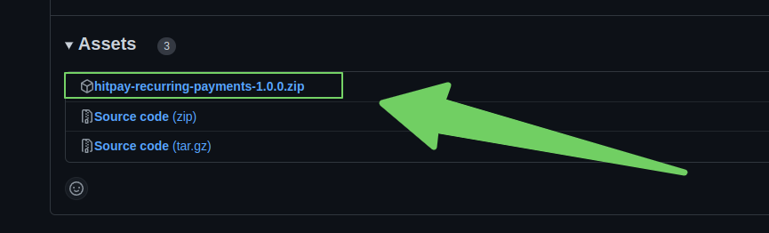
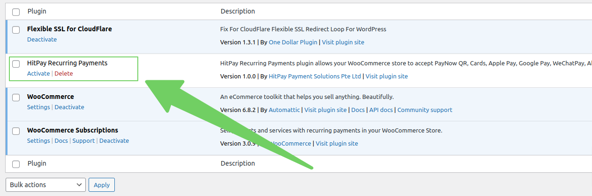
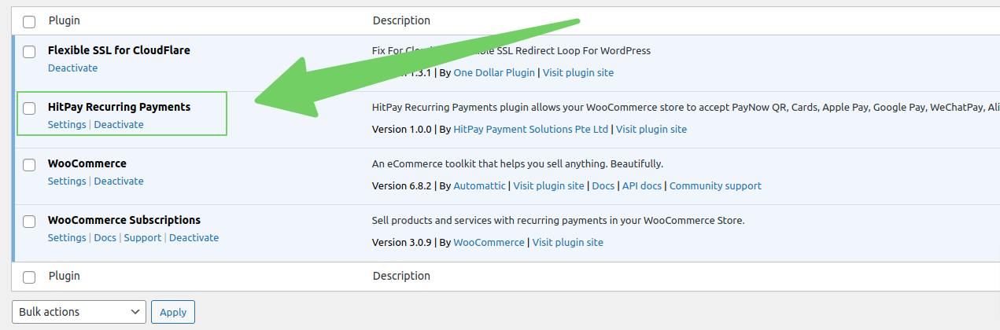
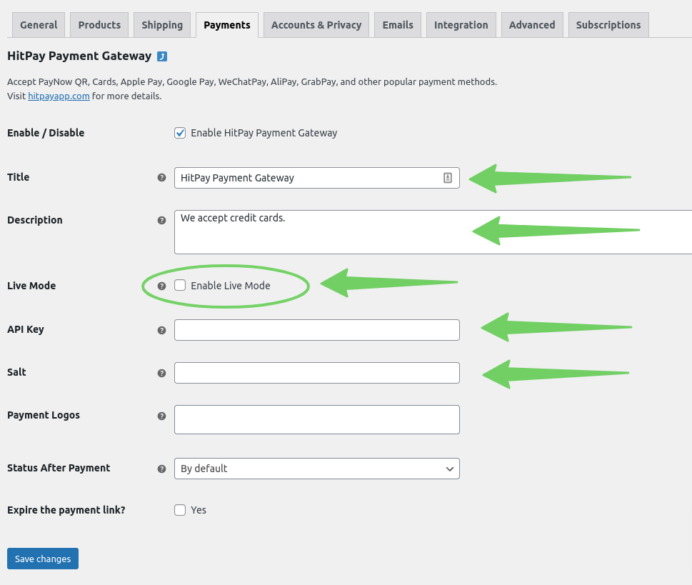
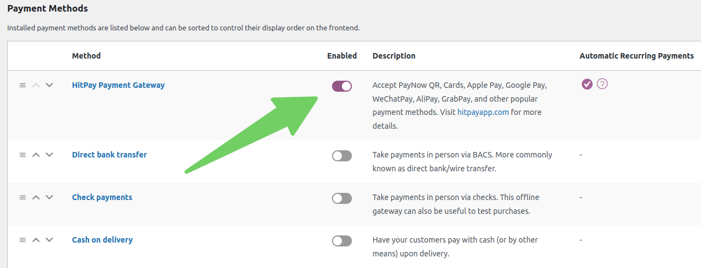

# HitPay Recurring Payments

**HitPay Recurring Payments** is a payment gateway plugin that extends [WooCommerce](https://woocommerce.com) and
[WooCommerce Subscriptions](https://woocommerce.com/products/woocommerce-subscriptions/) allowing HitPay merchants to accept payments using:
- PayNow QR.
- Cards.
- Apple Pay.
- Google Pay. 
- WeChatPay.
- AliPay.
- GrabPay.

## Subscriptions
The plugin has [subscription support](https://woocommerce.com/products/woocommerce-subscriptions/), so you can create and manage products with automatic recurring payments.

Here's the [store manager guide](https://woocommerce.com/document/subscriptions/store-manager-guide/) on how to use subscription features with your WooCommerce store.

## Installation

Requirements: [WordPress](https://wordpress.org), [WooCommerce plugin](https://woocommerce.com), [Subscriptions extension](https://woocommerce.com/products/woocommerce-subscriptions/).

There are 3 ways to install the **HitPay Recurring Payments** plugin: 
- Automatic Plugin Installation.
- Upload via WordPress Admin.
- Manual Plugin Installation.

### Automatic Plugin Installation
This is the simplest method of installing the plugin, and it will be available as soon as the plugin is added to the WordPress Plugins Directory.
It is currently in the process of being added.

### Upload via WordPress Admin

#### Step 1: Getting the plugin
1. Download the latest version of the plugin (ZIP file) on the [Releases](https://github.com/hit-pay/woocommerce-recurring/releases) page.

#### Step 2: Uploading the plugin to the WordPress
1. Navigate to **Plugins** > **Add New**.
2. Click the **Upload Plugin** button at the top of the screen.
3. Select the ZIP file from your local filesystem.
4. Click the **Install Now** button.
5. When the installation is complete, you'll see "Plugin installed successfully".

### Manual Plugin Installation
In rare cases, you may need to install the plugin by manually transferring the files onto the server. This is recommended only when absolutely necessary, for example when your server is not configured to allow automatic installations.

This procedure requires you to be familiar with the process of transferring files using an SFTP client. It is recommended for advanced users and developers.

All you need to do is to move an unzipped folder with the plugin to folder `/wp-content/plugins/`.

## Activating the plugin

1. Make sure you have [WooCommerce](https://woocommerce.com) and [WooCommerce Subscriptions](https://woocommerce.com/products/woocommerce-subscriptions/) plugins installed and activated.
2. Navigate to **Plugins**, find the **HitPay Recurring Payments** plugin and click the **Activate** button.

## Setting up the plugin

1. Navigate to **Plugins**, find the **HitPay Recurring Payments** plugin and click the **Settings** button.

2. Fill the main fields in the settings form (**Title**, **Description**, **API Key**, **Salt**). You can find your API key and Salt on the **HitPay Web Dashboard** under **Settings** > **Payment Gateway** > **API Keys**.
When you are ready click the **Enable Live Mode** checkbox. Click the **Save Changes** button.

3. Navigate to **WooCommerce** > **Settings** > **Payments** and activate the payment method.

